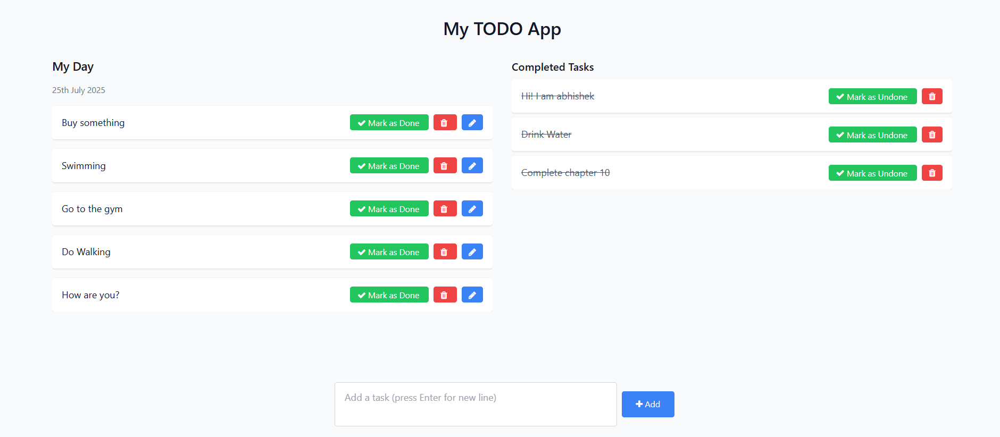

# 📝 Django To-Do App

A simple and clean task management web application built with Django. This app allows users to add, edit, delete, and mark tasks as done or undone.

---

## ⚙️ Features

- ✅ Add new tasks  
- 🖊️ Edit existing tasks  
- ☑️ Mark tasks as completed or incomplete  
- ❌ Delete tasks  
- 🎨 Clean UI using Django Templates (optionally with Tailwind CSS)  
- 🗃️ SQLite database for easy setup  

---

## 📸 Screenshots

### 🏠 Home Page


## 🚀 Getting Started

### 1. Clone the Repository

```bash
git clone https://github.com/abh0x1/To-Do-App.git
cd django-todo
```

### 2. Create and Activate Virtual Environment

```bash
python -m venv env
env\Scripts\activate       # On Windows
# source env/bin/activate  # On macOS/Linux
```

### 3. Install Dependencies

```bash
pip install -r requirements.txt
```

### 4. Apply Migrations

```bash
python manage.py makemigrations
python manage.py migrate
```

### 5. Run the Server

```bash
python manage.py runserver
```

Visit: [http://127.0.0.1:8000/](http://127.0.0.1:8000/)

---

## 🔗 URL Patterns

| Route                        | Description               |
|-----------------------------|---------------------------|
| `/`                         | Home page (list of tasks) |
| `/add/`                     | Add a new task            |
| `/edit_task/<id>/`          | Edit a task               |
| `/mark_as_done/<id>/`       | Mark task as done         |
| `/mark_as_undone/<id>/`     | Mark task as undone       |
| `/delete_task/<id>/`        | Delete a task             |

---

## 📦 Requirements

See `requirements.txt` for full list. Minimum required:

```
Django>=5.0
```

---

## 🧾 License

This project is licensed under the MIT License.
